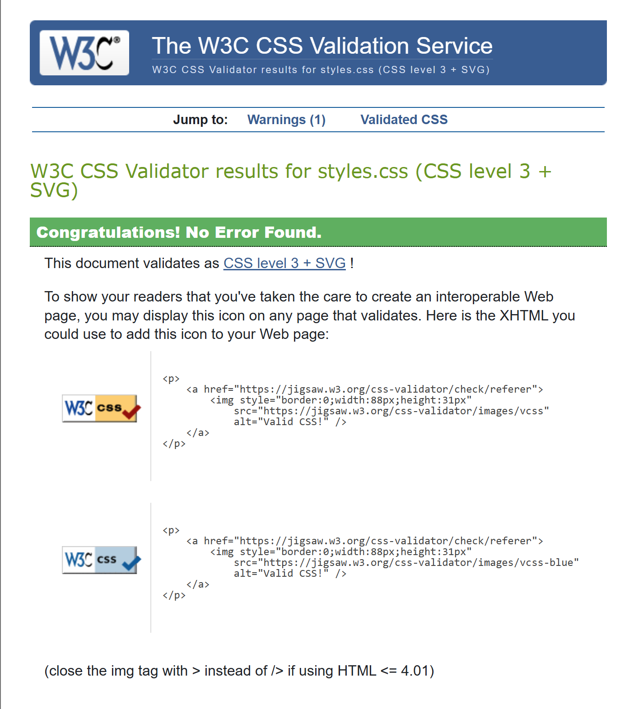

# INFSCI1570_Assignment_1

## 1. Website Overview:
- **Type of Website:** Sneaker Collection
- **Website Name:** Sharv's Favorite Sneakers
- **Purpose:** I created this website to show my interest in sneakers. Additionally, this website acts as assignment 1 for INFSCI1570.
## 2. Pages Summary:
1. **Homepage:** This page serves as the landing page for the entire website.
2. **Page One - Page Four:** These pages display all the sneakers I currently like/possess.
3. **Page Five (Additional Information):** This page displays additional sneakers that I own/possess. Furthermore, this page has a form that adds basic interactivity to the website through user interaction. 
## 3. HTML Elements:
1. head - this section holds metadata, Google Fonts links, reference links for CSS, and the page title 
2. Semantic Elements: header, main, footer, nav, section, article, and aside - These tags help build a properly structured website. 
3. table, thead, tbody, tr, th, td - This set of tags is needed to build a table in HTML. In my case, I built a table that contains information about sneakers.
4. form, label, input, button - These elements are used to collect user input and save the input. In this case, I collected and saved the user's favorite shoe within local storage
5. ul, li, ol - The 3 elements help build lists within HTML. On my website, they aid in displaying information about each sneaker, such as release date, identifier, price, etc.
6. img & alt - The img tag adds visuals to a website. So, for my website, the img tag is used to display sneaker images. In terms of the alt tag, it helps provide an appropriate description of the image if the image fails to load. 
7. h1, h2, p, strong, u, i - Elements like these serve as text-level elements within webpages. Consequently, my website utilizes these elements to enhance the overall appearance of the site. 
8. a - This element helps create hyperlinks for navigation. On my website, the a tag is used within the nav to move between different pages. 
## 3a. HTML Validation:

## 4. CSS Design:
1. Flexbox - Used "display: flex" to align and center the contents of the webpage, such as titles, sneaker images, button groups, etc. This helped create a responsive and balanced layout.
2. Background Color + Color Scheme - Used a consistent color palette for all pages. This helps build a clean and user-friendly website.
3. Fonts/Text - Imported Google Fonts to move away from the traditional fonts/styles. In doing so, I was able to create a more unique and personalized website.
4. Navigation & Links - I styled the "a" tags with custom aspects like no underline, larger font sizes, font sizes from Google Fonts, and hover effects for interactivity.
5. Buttons - I applied various styles to buttons. These styles included matching colors, rounded corners, shadows, etc.
6. Images - I made some changes to image proportions to make them fit better on the page. For example, I used "object-fit: cover" to maintain the image proportions.
7. Borders & Shadows - For almost every HTML segment, I applied borders or shadows. For example, I used "border-radius" to create soft, well-rounded corners. On the other hand, I used shadows to help make elements, like images or tiles, pop from the rest of the page. 
8. Lists - For my lists that outlined details about sneakers, I adjusted the spacing/margins to improve readability. Not to mention, I also chose to style the points as roman numerals. 
## 4a. CSS Validation:

## 5. JavaScript Interactivity:
